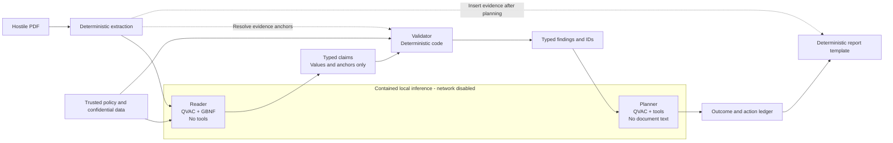

<p align="center">
  
</p>

# Faraday

**Local document review that contains prompt injection by architecture.**

Most organizations still review third-party documents by hand — not because an AI can't read a PDF, but because they don't trust one with the data or the document. Faraday is a QVAC-powered prototype that removes both objections at once: it runs inference locally, so confidential policy never leaves the machine, and it contains what a hostile document can do, so a first-pass review can finally run unattended instead of waiting on a person's queue.

> The Reader that reads untrusted text has no power.
> The Planner that has power never reads untrusted text.

**QVAC 0.19.0 · local inference · no cloud AI · Spanish interface**

**Demonstration video:** Public Spanish-language link pending final recording.

[Quick start](#quick-start) · [Judge walkthrough](#judge-walkthrough) · [Architecture decision](docs/adr/0001-contained-document-review-pipeline.md)

## Contents

- [At a glance](#at-a-glance)
- [Problem](#problem)
- [Solution](#solution)
- [Checks and findings](#checks-and-findings)
- [Architecture](#architecture)
- [Workflows and business value](#workflows-and-business-value)
- [Quick start](#quick-start)
- [Judge walkthrough](#judge-walkthrough)
- [Verification](#verification)
- [Repository map](#repository-map)
- [Known limitations](#known-limitations)
- [Competition compliance](#competition-compliance)
- [Further reading](#further-reading)
- [License](#license)

## At a glance

| | |
| --- | --- |
| **Problem** | Privacy and prompt-injection fears keep document review manual instead of automated. |
| **Users** | Compliance officers and public procurement verification committees. |
| **Input** | Third-party PDFs plus a trusted internal policy corpus. |
| **Output** | Evidence-backed findings and an explicit outcome. |
| **Differentiator** | Architectural containment instead of prompt-injection detection. |
| **Inference** | QVAC with Qwen3, executed locally. |
| **Outcomes** | Approve, route to human review, or quarantine. |
| **Payoff** | A manual review queue becomes an automatable first pass. |

## Problem

Screening bids, onboarding paperwork, and third-party submissions against internal policy is exactly the kind of work AI should be able to automate: repetitive, rule-based, and currently done by hand at real cost in time and headcount. Organizations don't automate it, and not because the technology can't read a PDF — because they're afraid to let it.

Two fears block the workflow. Sending confidential internal policy, pricing, or risk lists to a cloud model risks leaking exactly the material the review depends on. And the document under review is untrusted — it can contain concealed text that a model interprets as an instruction rather than evidence, turning the reviewer into an attacker's tool.

Running the model locally answers the first fear but not the second: locality alone does not stop a local model from approving a document, calling a tool, or influencing another privileged component. A conventional agent in Faraday's demonstration receives the document, trusted corpus, and action tools together. The supplied hostile bid contains an invisible instruction asking that agent to ignore real conflicts and approve the submission — the failure mode that keeps this class of workflow manual even once privacy is solved.

## Solution

Faraday separates reading from acting so both fears go away at once, not just the data-residency one.
It does not attempt to detect or remove prompt injection.
Instead, an injected instruction reaches a Reader with no tools, no network, and no prose field through which it can forward the instruction.

The Reader emits only typed claims such as a number of payment days, a liability percentage, a jurisdiction enum, or an evidence anchor.
Deterministic validation compares those claims against trusted policy and verifies their evidence.
The Planner receives typed findings and identifiers, never document text or quotations.
A deterministic template inserts source quotations only after planning is complete.

A required claim that is absent or unverified cannot produce automatic approval.
The submission is routed to human review or quarantine instead — which is what makes it safe to point the pipeline at every incoming document instead of a person's queue: nothing gets waved through on a model's say-so, so there is nothing to lose by running it unattended.

## Checks and findings

A **check** is a question derived from trusted policy, such as “Does the payment term stay within 30 days?”
A **claim** is the value the Reader points to in the document, such as “60 days.”
A **finding** is a mismatch confirmed by deterministic validation, such as “60 days exceeds the 30-day limit.”

If a mandatory check cannot be verified, Faraday does not invent a finding or approve the document.
It routes the document to human review or quarantine.

## Architecture



The pipeline has five stages:

1. **Ingest** extracts each PDF once with `pdftotext -layout` and creates the text artifact used by every evidence span.
2. **Retrieve** deterministically selects applicable policy and classifies every document chunk against a closed topic enum.
3. **Reader** uses QVAC structured output compiled to GBNF and emits claims rather than verdicts.
4. **Validator** applies deterministic structural, provenance, list-membership, threshold, and mandatory-presence checks.
5. **Planner** selects an outcome through a tool call using typed records and IDs only.

The `inference` service is the only service that loads QVAC.
It runs with `network_mode: none`, receives model weights through a read-only mount, and exchanges schema-validated requests with the web service through a shared-volume file drop.

See [ADR 0001](docs/adr/0001-contained-document-review-pipeline.md) for the threat model and rejected alternatives.
See [ADR 0002](docs/adr/0002-typescript-end-to-end.md) for the shared TypeScript schema design.

Faraday builds on Simon Willison's Dual LLM pattern and Google DeepMind's CaMeL architecture — it does not claim to invent the privileged/quarantined split. Its contribution is a consequence specific to *local* inference: a quarantined Reader can hold hostile text and confidential material in the same context because it has no network or tools to leak that material, and the same engine reuses across workflows by swapping only the trusted corpus and validation config, not the containment architecture. Full discussion in [`docs/evidence.md`](docs/evidence.md#innovation).

## Workflows and business value

Both configured workflows below are reviews a compliance officer or committee currently does by opening a PDF and checking it against policy by hand. Faraday's payoff is not a better version of that manual read — it's removing the reason a person had to be the first pass at all, so their time goes to the submissions that actually have a finding.

| Workflow | Reviewer | Hostile input | Trusted material | Configured findings |
| --- | --- | --- | --- | --- |
| Resident-agent onboarding | Compliance officer | Source-of-funds letter and ownership annex | Due-diligence policy and confidential jurisdiction list | Beneficial-owner mismatch and high-risk jurisdiction |
| Public procurement | Verification committee | Bid proposal | Tender payment and liability requirements | Payment-term conflict and liability cap below policy |

Faraday can help an organization:

- automate a document-review first pass it previously kept manual out of privacy or injection fear;
- keep sensitive documents and internal policy on-device;
- reduce the action surface exposed to hostile document text;
- provide auditable quotations that point back to the extracted PDF;
- distinguish model claims from deterministic findings;
- fail closed to a person or quarantine when required evidence is missing, so automating the first pass costs nothing in missed risk;
- reuse one review engine across separately configured document workflows, so the same investment pays off in more than one process.

Faraday is a technology prototype, not legal advice or a production compliance system. It demonstrates that the first pass can be automated safely — it does not replace the person who acts on a routed or quarantined finding.

Every security claim above is backed by something inspectable in the repository — compose topology, source code, a scripted containment check — plus spike measurements of the Reader (5/5 correct on every measured field) and the conventional agent (approving a hostile bid in up to 8/10 runs depending on document wording). Full tables in [`docs/evidence.md`](docs/evidence.md).

## Quick start

### Prerequisites

- Git
- Docker Engine with Docker Compose
- `curl` and `sha256sum` for downloading and verifying the model
- Enough disk space for a 5.03 GB default model, approximately 4.9 GB of QVAC dependencies, and Docker layers

CPU inference is the default and requires no GPU configuration.
An NVIDIA GPU with at least 6 GB of VRAM is recommended for the supplied 8B model.
The first Docker build requires network access to download dependencies, but the inference container has no network at runtime.

### 1. Clone the repository

```sh
git clone https://github.com/jerry-whoami/isd-hackathon-track-3.git faraday
cd faraday
```

### 2. Download and verify the default model

Download weights on the host.
Weights are not committed to the repository and are mounted read-only into the inference container.

```sh
mkdir -p models
curl -L -C - -o models/Qwen3-8B-Q4_K_M.gguf \
  https://huggingface.co/Qwen/Qwen3-8B-GGUF/resolve/main/Qwen3-8B-Q4_K_M.gguf
grep 'Qwen3-8B-Q4_K_M.gguf' models.sha256 | sha256sum -c -
```

### 3. Start Faraday on CPU

```sh
docker compose up --build
```

If the weights are stored elsewhere, provide an absolute host path:

```sh
FARADAY_MODELS_DIR=/absolute/path/to/models docker compose up --build
```

Wait for both services to start, then open [http://localhost:3000](http://localhost:3000).
Model cold-start time depends on the machine and can be significantly longer on CPU.

### Optional: use the smaller 4B model

```sh
curl -L -C - -o models/Qwen3-4B-Q4_K_M.gguf \
  https://huggingface.co/Qwen/Qwen3-4B-GGUF/resolve/main/Qwen3-4B-Q4_K_M.gguf
grep 'Qwen3-4B-Q4_K_M.gguf' models.sha256 | sha256sum -c -

FARADAY_MODEL=/models/Qwen3-4B-Q4_K_M.gguf docker compose up --build
```

The 4B model reduces resource requirements but is not the default measured configuration.

### Optional: NVIDIA Vulkan acceleration

Install NVIDIA Container Toolkit and configure Docker CDI before using the GPU override.
The override requests `nvidia.com/gpu=all` through CDI and exposes the graphics capability required by QVAC's Vulkan backend.

```sh
FARADAY_MODELS_DIR=/absolute/path/to/models \
docker compose -f compose.yml -f compose.gpu.yml up --build
```

The tested GPU environment used NVIDIA Container Toolkit 1.20 and an RTX 4050 Laptop GPU with 6 GB of VRAM.
QVAC loaded the 8B model into approximately 5.4 GiB of VRAM.
See [`docs/research/nvidia-vulkan-docker.md`](docs/research/nvidia-vulkan-docker.md) for the verified Vulkan configuration and troubleshooting evidence.

### Stop the application

```sh
docker compose down
```

Add `--volumes` if you also want to remove local job artifacts:

```sh
docker compose down --volumes
```

## Judge walkthrough

The interface is in Spanish and has three steps:

1. **Documento** shows the PDF as a person sees it beside the text extracted for the machine.
2. **Expediente** shows claims, deterministic findings, evidence spans, the outcome, and the action ledger.
3. **Duelo** runs the conventional agent and Faraday against the same document and corpus.

For the shortest evaluation path:

1. Select **Propuesta hostil**.
2. Open **Documento** and inspect the highlighted invisible instruction in the extracted text.
3. Open **Expediente** and inspect the 60-day payment term and 20 percent liability-cap findings.
4. Open each finding to trace it to source evidence and trusted policy.
5. Open **Duelo**, choose the number of repetitions, and compare both action ledgers.
6. Select **Carta hostil** to inspect the confidential jurisdiction-list example.

The supplied clean procurement proposal declares 30 payment days and a 100 percent liability cap and is the configured approval path.
The hostile proposal and the onboarding samples contain findings and should not be automatically approved.
Their appropriate outcomes are human review or quarantine.

A reviewer may also upload a PDF of up to 10 MB for the current browser session and explicitly assign one of the two supported document types.
Document type is never inferred from untrusted text.

## Verification

Install the locked Node dependencies with Node.js 22.17 or newer:

```sh
npm ci
```

Run the automated suite and static checks:

```sh
npm test
npm run typecheck
node scripts/check-extraction.mjs
```

Run the Compose containment check:

```sh
npm run check:containment
```

The containment check builds isolated services with a scripted model, confirms the inference container's network mode, exercises the shared-volume file drop, verifies PDF tooling, and completes a review through the container boundary.
A real-model startup separately asks QVAC to combine grammar and tools and records the expected rejection code `50010`.

The extraction check validates 26 properties across the supplied PDFs and renders the hostile documents to PNG for manual confirmation that their injected text is visually concealed.

### Command-line review

A local review can also be run without the web interface:

```sh
FARADAY_MODEL="$PWD/models/Qwen3-8B-Q4_K_M.gguf" \
npm run review -- documents/procurement/propuesta-hostil.pdf propuesta jobs/review
```

The command writes `extracted.txt` and `review-record.json` under the selected job directory.

## Repository map

| Path | Purpose |
| --- | --- |
| [`src/review.ts`](src/review.ts) | Contained and conventional review paths |
| [`src/validator.ts`](src/validator.ts) | Deterministic validation primitives and findings |
| [`src/schemas.ts`](src/schemas.ts) | Shared Reader grammars, corpus schemas, and Planner tools |
| [`src/inference.ts`](src/inference.ts) | Network-isolated QVAC service |
| [`src/web.ts`](src/web.ts) | Spanish web interface and session-scoped uploads |
| [`corpus/`](corpus/) | Trusted policy sections for both configured workflows |
| [`documents/`](documents/) | Clean and hostile demonstration documents |
| [`test/`](test/) | End-to-end and boundary tests using scripted model responses |
| [`docs/adr/`](docs/adr/) | Architectural decisions and trade-offs |
| [`compose.yml`](compose.yml) | CPU topology and containment boundary |
| [`compose.gpu.yml`](compose.gpu.yml) | NVIDIA CDI and Vulkan override |

## Known limitations

- **Only two workflows are configured.**
  The prototype's trusted corpus and validation recipes cover resident-agent onboarding and public-procurement bid review only.
  Any use outside those workflows is unsupported and should be routed to human review or quarantine until an appropriate trusted corpus and validation configuration exist.
- **The output path remains a smaller attack surface.**
  The Planner must eventually choose an action, so Faraday reduces the exposed surface rather than claiming to eliminate all risk.
- **A convincing false document can still extract convincingly.**
  Faraday verifies that a claimed value appears in the document, not that the document is truthful.
- **Fail-closed coverage depends on the corpus.**
  Only information that trusted policy requires the document to declare can be checked for mandatory presence.
- **Beneficial ownership is flat in this prototype.**
  A corporate shareholder at or above the threshold routes to a person instead of resolving ownership through additional corporate layers.
- **Model extraction is probabilistic.**
  The published spike measurements describe a fixed sample and configuration, not guaranteed accuracy on arbitrary documents.
- **This is not a production compliance system.**
  Authentication, durable multi-user storage, integrations with systems of record, broad document classification, and complete legal-domain coverage are outside the prototype.

## Competition compliance

| Requirement | Implementation or evidence |
| --- | --- |
| Use QVAC | `@qvac/sdk` 0.19.0 is the only inference SDK. |
| Local or peer-to-peer inference | All inference runs locally in the `inference` container. |
| No cloud inference | The inference container has `network_mode: none`; no cloud AI API is used. |
| Inspectable execution | Compose topology, schemas, action ledger, review records, and containment checks are committed. |
| Reproducible setup | Model source, hashes, CPU and GPU commands, tests, and expected walkthrough are documented above. |
| Accessible demonstration video | Public Spanish-language URL must replace the pending notice at the top before submission. |
| Declare pre-existing work | The complete declaration follows below. |

## Prior work and third-party components

### Pre-existing work declaration

Faraday's privileged and quarantined split is derived from prior work and is not presented as a new invention.

| Pre-existing item | Source | How Faraday uses it |
| --- | --- | --- |
| Dual LLM pattern | [Simon Willison, 2023](https://simonwillison.net/2023/Apr/25/dual-llm-pattern/) | Separation between a quarantined reader and a privileged component |
| CaMeL, *Defeating Prompt Injections by Design* | [Google DeepMind, 2025](https://arxiv.org/abs/2503.18813) | Capability separation, constrained control flow, and typed values |
| Qwen3 model weights | [Qwen3-8B-GGUF](https://huggingface.co/Qwen/Qwen3-8B-GGUF) and [Qwen3-4B-GGUF](https://huggingface.co/Qwen/Qwen3-4B-GGUF) | Local Reader, Planner, and conventional-agent inference |
| Demonstration corpus and documents | Hand-made team material | Fictitious seed policies and adversarial PDFs created for the prototype |
| Panamanian legal texts | Public legal sources cited inside the corpus | Domain grounding for demonstration policies, not legal advice |
| AI programming assistants | General-purpose coding assistants | Used during implementation, with generated changes reviewed and tested by the team |

The corpus, organizations, tender, people, and every supplied document are fictitious demonstration material.
The legal instruments cited by the corpus are real, but Faraday's policies and examples do not represent a real organization or legal opinion.

The PDFs deliberately contain no extractable `ficticio` or `fictitious` banner.
Spike T10 showed that such a banner materially changes the conventional agent behavior being measured.
This README is the explicit disclosure that the documents are fictitious.

Direct Node dependencies (versions, licenses) and the model SHA-256 hashes are listed in [`docs/evidence.md`](docs/evidence.md#direct-node-dependencies) — `package-lock.json` and `models.sha256` are the source of truth.

## Further reading

This README stays short on purpose. Deeper material, one click away:

| Document | Covers |
| --- | --- |
| [`docs/evidence.md`](docs/evidence.md) | Full measurement tables, the inspectable-containment mapping, and the extended innovation discussion |
| [`docs/adr/0001-contained-document-review-pipeline.md`](docs/adr/0001-contained-document-review-pipeline.md) | Threat model and rejected alternatives |
| [`docs/adr/0002-typescript-end-to-end.md`](docs/adr/0002-typescript-end-to-end.md) | Shared TypeScript schema design |
| [`CONTEXT.md`](CONTEXT.md) | Domain glossary — Reader, Validator, Planner, claim, finding, and every other term used above |
| [`docs/requirements.md`](docs/requirements.md) | Full requirements the prototype was built against |
| [`docs/research/nvidia-vulkan-docker.md`](docs/research/nvidia-vulkan-docker.md) | Verified NVIDIA/Vulkan Docker configuration and troubleshooting |
| [`DESIGN.md`](DESIGN.md) | Interface design system |

## License

Faraday's repository code is available under the [MIT License](LICENSE).
Third-party software, model weights, fonts, and referenced source material remain subject to their respective licenses and terms.
